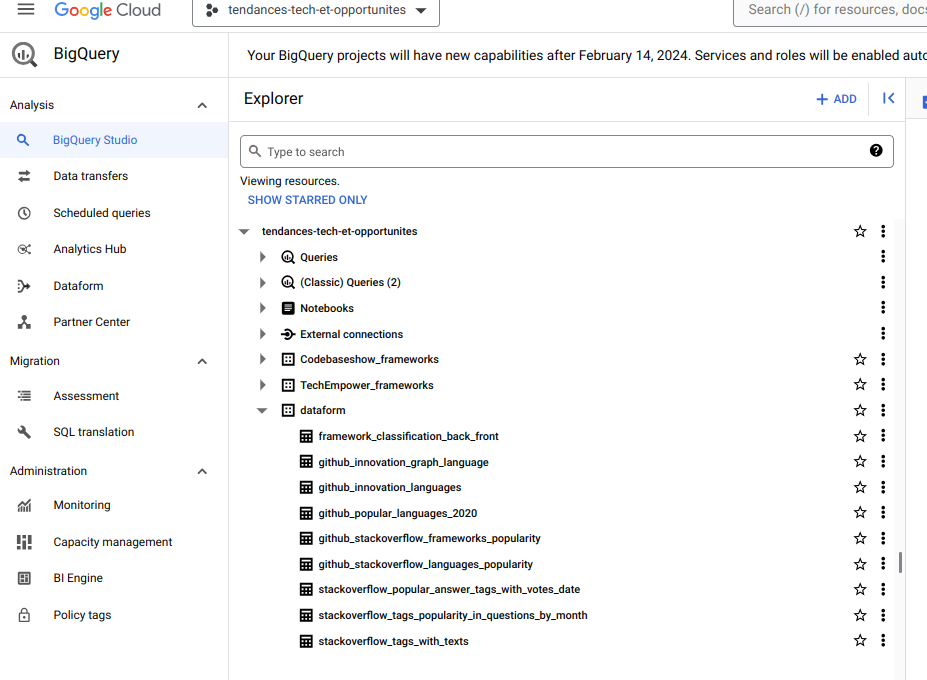
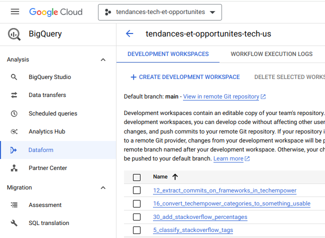
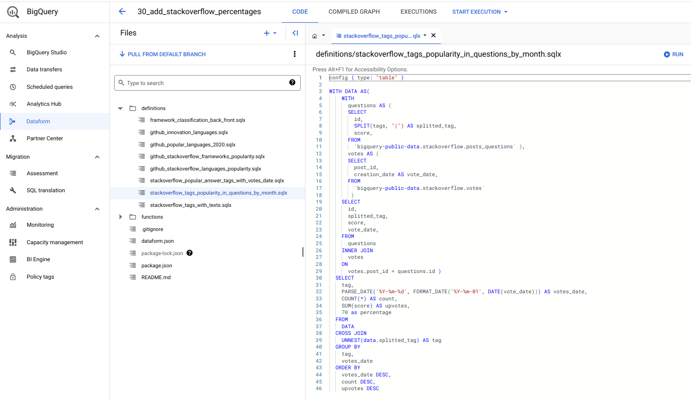
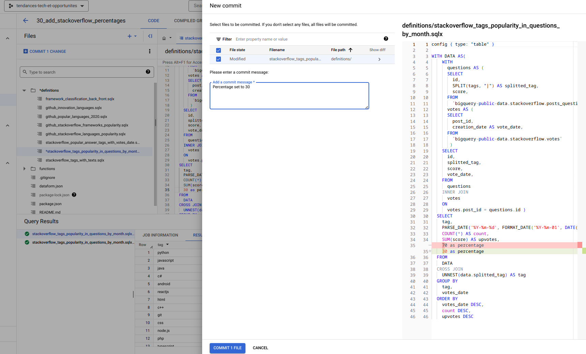
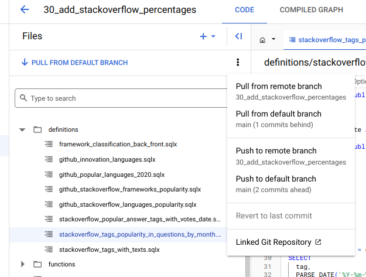
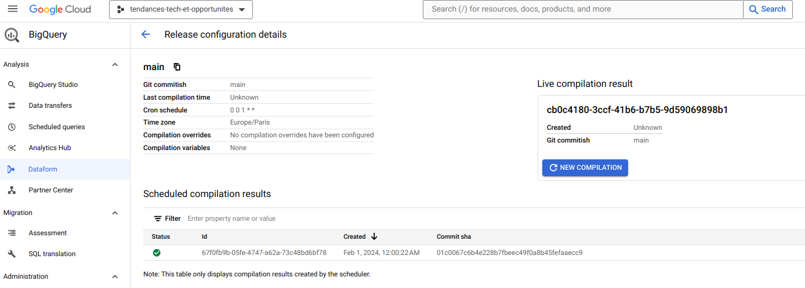
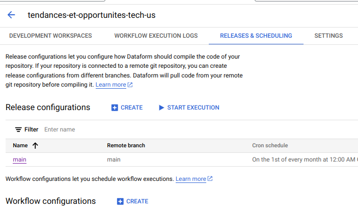
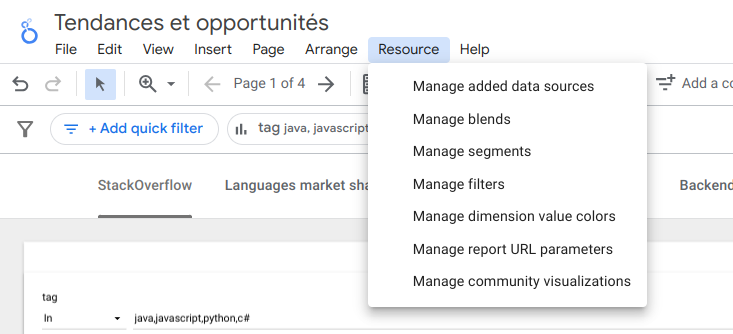
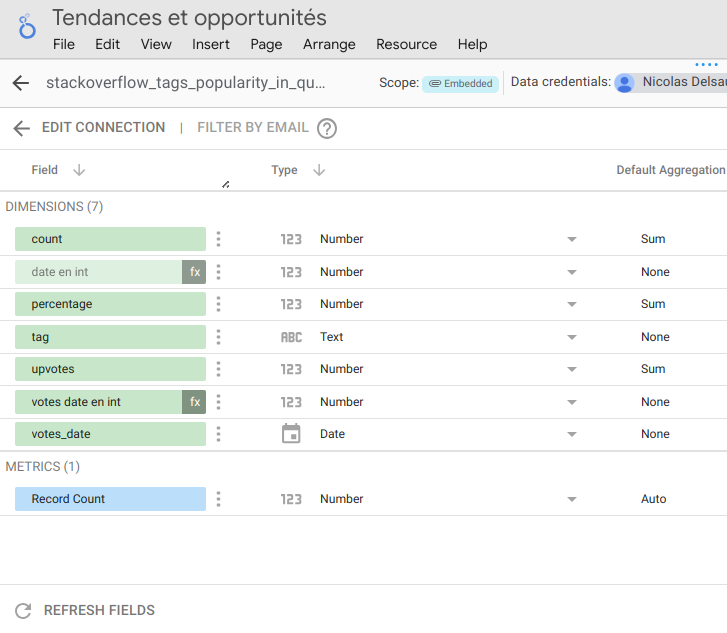
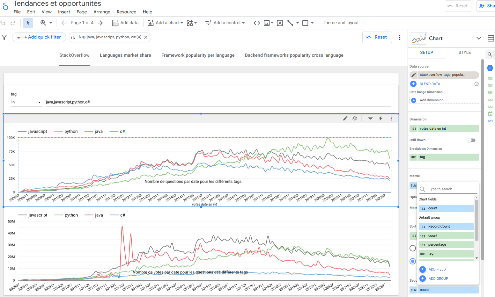

# Step by step guide to add a column on the graph

The projet `tendance-tech-et-opportunites` consists in reports available on the [looker studio interface](https://lookerstudio.google.com/reporting/742da15c-8d95-492c-8b9b-77e82d71d6a9). This guide describes how to enrich the reports by taking the example of adding a new column to a table and displaying it on a graph.

## 1. Make sure you have access to data

Looker studio gets its data from Big Query. You must first ensure you have access to the tables in the BigQuery console. Under the `dataform` dataset.  
  
If data are not available, ask an administrator for access (Nicolas Delsaux at the time of writing).

## 2. Create the development workspace for your feature

The feature is the answer to an issue, [Replace absolute numbers in Stackoverflow by percentages #30
]([TODO link](https://github.com/Zenika/tendances-et-opportunites/issues/30)) here.
Open the dataform tab in Big Query, select `tendance-opportunites-tech-us`, Click on `Create a new development workspace`.

When choosing the name **Do reference your issue number at the beginning of the workspace name** (e.g. _30_add_stack_overflow_percentages_).  
Creating the workspace will create a branch on github (the Google Cloud project is linked to this repo).

## 3. Code

In the development workspace, code the changes you need .
Here we'll add a dummy column `percentage` equaling 70.

Click on `Run` to test them. _This will not modify the actual BigQuery tables, your are in your own environment._

Once you're ready, click on `Commit changes`.

Do not forget to push your changes to the remote after you have committed.

## 4. Merge your changes on Github

Go on Github, create a PR from your feature branch to the main branch, review it and merge it.

_Your changes are not in BigQuery yet_

## 5. Deploy your changes in BigQuery

Back to DataForm in BigQuery. See the release configurations and click on the configuration `main` compile the pipeline you have just created by clicking on `Run Compilation`.  
  
You can now run the pipeline by clicking on `Start execution`

Execution logs can be seen under the tab `Workflow execution logs`. Once it has been executed go to BigQuery to make sure your column is there.

## 6. Bring your changes to LookerStudio

Go to the LookerStudio interfaces.
Click on `Resources/Managed Data Sources`.

Click on the table you've modified and click `Refresh fields` so that LookerStudio is aware a new column has been created.

Then back to the graph view. Click the `Edit` button, edit some graph properties and you can change the y column to `percentage`.

